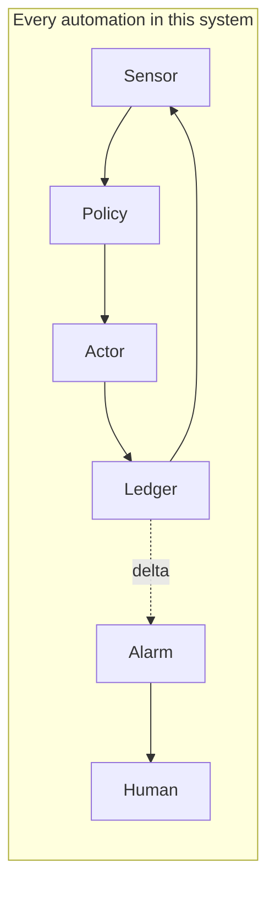
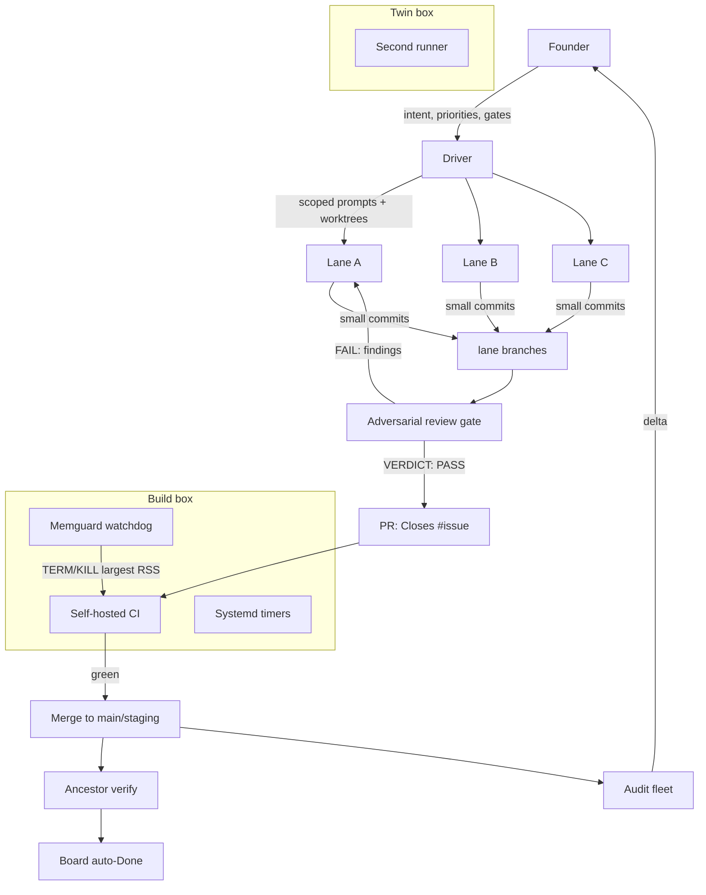

# agentic-blueprint

A pullable blueprint for running a small fleet of AI coding agents against real codebases with self-hosted CI, watchdogs, boards, and audit loops. Distilled from the NeoLife setup (the canonical reference implementation). Private. No secrets, no hostnames that matter, no tokens - structure and policy only.

## The one idea

Everything is a loop. Every piece of this system is a feedback loop with five parts:

1. **Sensor** - how the loop notices state (a timer, a CI webhook, a log diff, a ps check).
2. **Policy** - the rule that decides (a gate, a threshold, a verdict requirement).
3. **Actor** - what changes the world (an agent lane, a script, a merge).
4. **Ledger** - where truth is recorded (git, a baseline file, a board, a checkpoint file).
5. **Alarm** - the delta channel (exit code 10, a NEW FINDINGS block, a page to the human).

If a candidate automation cannot name all five, it is not a loop yet. It is a script.

## The machine at a glance

## Contents

- `docs/01-build-loop.md` - the lane lifecycle: prompt, commit, review gate, PR, CI, merge, verify
- `docs/02-driver-executor.md` - the driver/executor split and lane isolation rules
- `docs/03-forge-ci.md` - self-hosted runners, slices, ceilings, memguard
- `docs/04-timers.md` - systemd timer anatomy: baseline, diff, alert-on-delta
- `docs/05-boards.md` - issue-first flow and close-the-loop automation
- `docs/06-twin-box.md` - the two-box failover pattern
- `docs/07-audit-fleet.md` - the 11 standing audit loops
- `docs/08-watchdogs.md` - watchdog design rules
- `ADOPT.md` - how to pull this onto any codebase
- `templates/` - copy-ready units and prompt skeletons

## Write-time guardrails

Copy `templates/guardrails` into the project root and merge the Claude settings snippet with existing settings. OpenCode loads the plugin automatically. See `templates/guardrails/.agent-guardrails/README.md`; activate the Git hook separately in each worktree. This is an early deterministic filter, not a substitute for CI, independent review, or per-project rules.
