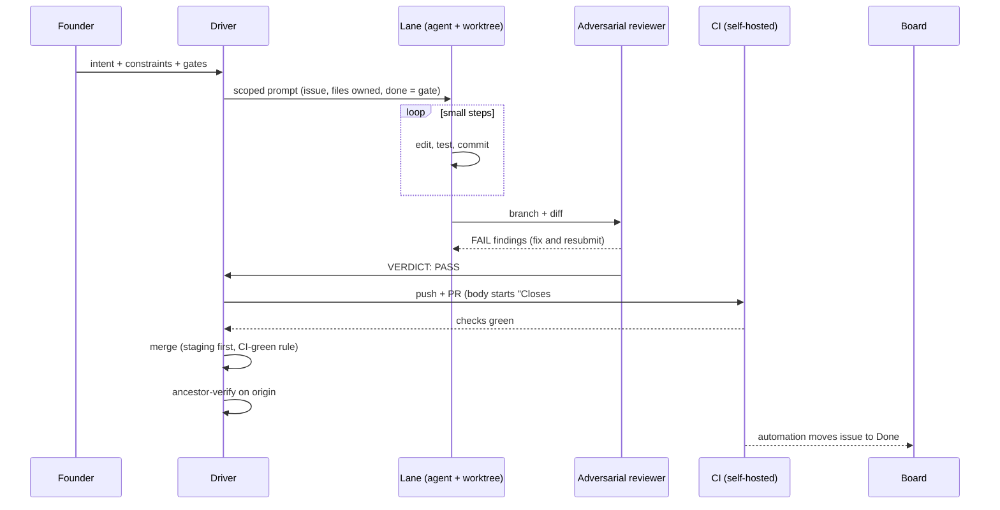

# 01 - The build loop

The core loop: intent in, verified merged code out. Everything else in this blueprint exists to keep this loop honest.

## Rules that make it work

**Small commits, always.** Lanes commit working increments to their own branch constantly. A lane that holds 3 hours of uncommitted work is a liability; a lane that commits every 10 minutes is a tape you can rewind.

**The review gate is adversarial, not polite.** The reviewer is a separate agent run with a brief that says *hunt for bugs*, given the diff and the files, ending in exactly one verdict line. Findings go back to the lane. Nothing pushes without `VERDICT: PASS`. This catches real bugs roughly every other review - precedence bugs, secret-leak vectors, false-green health checks, wrong PR bases.

**Fast lane vs heavy lane.** Config, copy, typos, small UI, under ~50 production lines: fast lane, lighter ceremony. Auth, payments, security, crypto, schema, anything customer-facing: full gate, E2E required, no exceptions.

**Merge on green.** When CI is green the PR merges to staging per the standing rule - the human is told, not asked. Deletions and risky shapes still hold for his word.

**Ancestor-verify after every merge.** After the merge, prove the merge commit is an ancestor of origin/main (or staging) and that the thing the PR removed is actually gone. A merge that happened is not a merge that landed.

**Done means the gate passed.** A lane is done when its written gate passes, not when it feels done. The gate is in the prompt before work starts.
