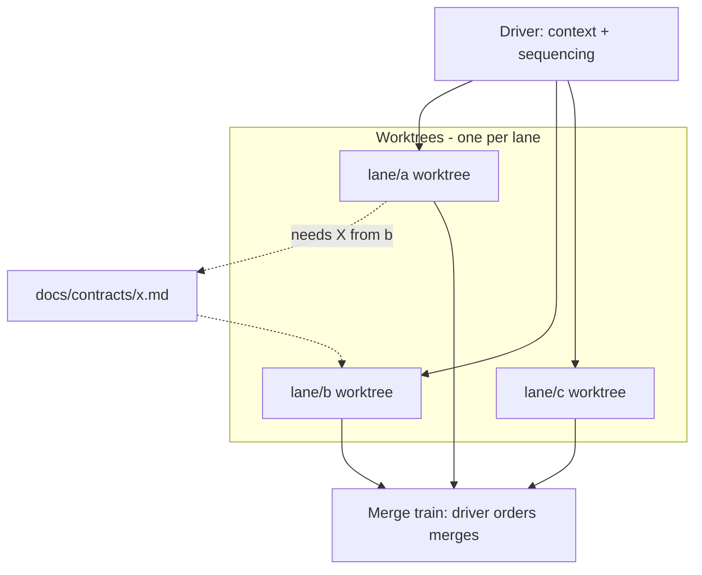

# 02 - Driver / executor pattern

## The split

**Driver** (one per effort): holds the whole context. Decomposes intent into lane scopes, owns the lane table, sequences merges, talks to the human. Never writes production code directly while driving.

**Executor lanes** (many, parallel): each gets a scoped prompt, an isolated worktree, a list of files it owns, and a gate. Lanes never touch each other's files. Cross-lane needs go through a contracts directory, not edits.

## Lane prompt anatomy

A lane prompt that works contains, in order:

1. **Where the spec lives** - "read these docs FIRST, they are the spec."
2. **Containment** - "stay inside this worktree; do not edit files owned by other lanes; the lane table says who owns what."
3. **Contracts** - "if you need a cross-lane interface, write it under docs/contracts/<name>.md and code against it."
4. **Commit discipline** - "commit small, working increments often."
5. **Resources** - memory/CPU limits, what services are resident and must not be restarted, where credentials come from (env file, never committed).
6. **Done** - the gate, written down, checkable.
7. **Continuation** - "if you finish early, here is the next slice."

## Kill-safety (learned the hard way)

- **Never blanket-kill by process name.** Agent runtimes are the lane engine; killing by name kills lanes you did not mean to kill. Only kill PIDs captured at launch.
- **Restarting a CI runner kills in-flight lane work** that shares the box. File changes and daemon-reloads only during lane hours; restarts when lanes are idle.
- **Resume prompts are first-class.** Lanes die (OOM, reboots, mistakes). Every lane can be resumed with: read your status file, git status, git log, continue exactly where you left off. Write status files so a cold resume loses minutes, not hours.
