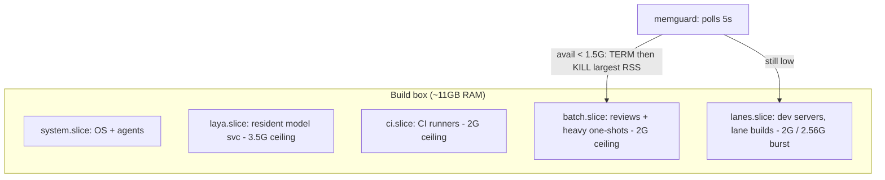

# 03 - Self-hosted CI and the memory budget

One modest box (the "forge") runs CI, agent lanes, and scheduled jobs. That only works with hard resource boundaries.

## Slice topology

Rules:

- **Everything heavy runs inside a slice with a ceiling.** No unconfined heavy jobs, ever. Reviews always run in batch.slice.
- **Runners are confined identically on every box** (see 06-twin-box). Check the unit drop-ins match before trusting a twin.
- **KillMode=mixed on runner units** so a stop kills the whole cgroup, not just the main process - otherwise job children leak and hold memory.
- **Memguard is the last line**, not the plan. A 5-second poller that TERM-then-KILLs the largest RSS process in the sacrificial slices when available memory drops below threshold. Order: batch first (reviews are retryable), then lanes. Never system.slice, never the model service.
- **/tmp is tmpfs.** Multi-GB scratch in /tmp is a memory allocation. Big scratch goes on disk. (This rule was written after a tmpfs tar filled RAM and OOM-killed both CI runners mid-flight.)

## Failure anatomy

When the box falls over it looks like: available memory slides to a few hundred MB, the OOM killer picks the runners, every in-flight CI job goes red at once, tunnels flap. Recovery is automatic (runners restart, memguard trims) but the *jobs* are lost. The fix is never "more killing" - it is ceilings + spill to the twin (06).
