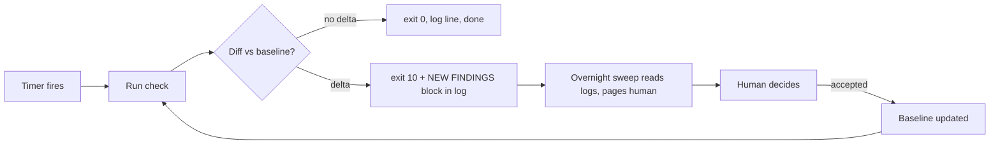

# 04 - Systemd timers: the cron that answers to someone

Scheduled work runs as systemd user timers, not crontab, because you get: a unit you can inspect (`systemctl --user list-timers`), logs in the journal, dependencies, and one obvious place to see what runs when.

## Timer anatomy (the audit pattern)

Every recurring job is the same loop:

- **Baseline-first.** First run writes the baseline; later runs diff. The alert is the *delta*, never the full state.
- **Exit 10 = something changed.** One reserved exit code across all audit jobs means one generic log-scraper catches everything.
- **Logs are append-only and dated.** The sweep greps for the alarm marker; it never re-derives.
- **Never self-heal without a human.** Audit loops report. Remediation is a separate, gated decision.

## Example cadence

| Job | When | What it watches |
|---|---|---|
| mirror-sync | nightly | every repo mirrored to the fleet box |
| secret-sweep | weekly | gitleaks over all mirrors, delta vs baseline |
| settings-drift | weekly | repo settings + branch protection drift |
| content refresh | daily | SEO content gates (auto-reject on fail) |
| dr-drill | monthly | disaster recovery in a throwaway VPC |
