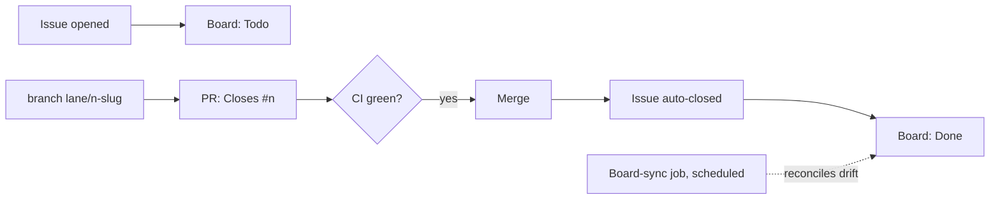

# 05 - Boards and closing the loop

The board is the ledger for work. It only stays true if machines move the cards.

## Rules

1. **Every piece of work is a real issue.** No draft cards, no untracked work. If an agent is doing it, an issue says so.
2. **Branch names carry the issue:** `lane/<issue#>-<slug>` (or `<type>/<issue#>-<slug>`).
3. **Every PR body starts with `Closes #<n>`** (same repo) or `Closes <org>/<repo>#<n>` (cross-repo). Merge closes the issue; board automation moves it to Done. No human card-shuffling.
4. **Board sync is a job, not a hope.** A scheduled workflow reconciles issue/PR state to the Projects board. It needs the project number wired (repo variable) and a token that can write Projects v2 - without both it fails loud, not silent.

## Why this matters for agents

Agents pick work by reading the board. If the board lies, agents duplicate work or build on closed ground. The loop is: work is not done when the agent says so - it is done when the issue is closed by the merge that contains the fix, and the board reflects it. Verify the merge landed (ancestor check), then the card moves itself.
