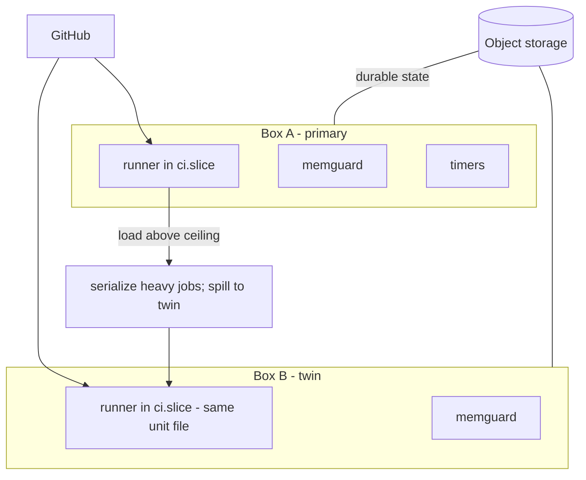

# 06 - The twin-box pattern

Two cheap boxes beat one big one: CI and lanes on box A, spill and redundancy on box B, both under the same confinement policy.

## Rules

- **Identical units.** Diff the runner service drop-ins between boxes; they must match (slice, KillMode, limits). A twin that is configured differently is not a twin.
- **Labels route work.** Runner labels decide what lands where. Heavy serial jobs get a label only the twin (or only the primary) carries, so you control placement without editing workflows under pressure.
- **Durable state lives off-box.** Both boxes are disposable. Checkpoints, baselines, and archives live in object storage; a box can die and the loops restart from the ledger.
- **Registration is zero-touch.** Adding a twin is: mint a registration token, run config.sh --unattended with labels, enable the service. If that takes more than 10 minutes, write down why and fix that instead.
- **Capacity decisions are the human's.** When sustained load exceeds one box, report with numbers (RSS, avail, kill counts) and let the human choose: bigger box, third box, or less parallelism. Agents recommend; they do not rescale.
