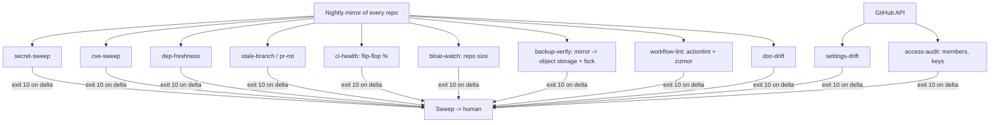

# 07 - The audit fleet

The audit fleet is a set of independent loops, each with its own timer, its own baseline, and the same alarm contract (exit 10 + NEW FINDINGS in the log). Each loop watches one failure mode of a real fleet of repos.

| # | Loop | Question it answers | Tool |
|---|---|---|---|
| 1 | mirror-sync | do we have every repo, current? | git mirror |
| 2 | cve-sweep | any known vuln in any lockfile? | osv-scanner |
| 3 | dep-freshness | how stale are dependencies? | package metadata |
| 4 | secret-sweep | did a new secret hit any branch? | gitleaks --all |
| 5 | stale-branch / pr-rot | what work is abandoned mid-flight? | git + gh |
| 6 | ci-health | which workflows are flaky or red? | run history API |
| 7 | bloat-watch | which repos are growing too fast? | git-sizer |
| 8 | backup-verify | can we actually restore? | object storage + fsck + drill |
| 9 | workflow-lint | are workflows sane and unpinned-Action-free? | actionlint, zizmor |
| 10 | access-audit | who/what can touch the org? | gh api |
| 11 | doc-drift | do docs still match the system? | small LLM pass |

## Design rules

- **Mirrors first.** Every other loop runs against local mirrors - one nightly clone/update job feeds all readers, so API rate limits and network flaps hit one job, not eleven.
- **Each loop is dumb.** Scan, diff, alert. No cross-loop cleverness; the sweep correlates.
- **Baselines are reviewable.** A baseline update is a human decision ("yes, that secret is a false positive, carry it"), recorded in the baseline file itself.
