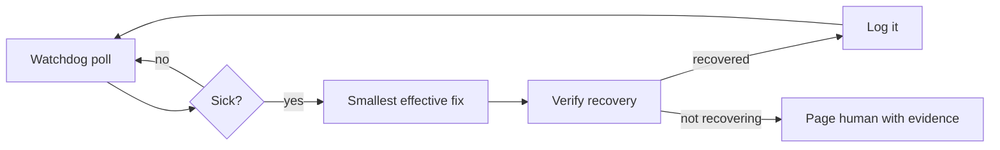

# 08 - Watchdog design rules

Watchdogs are the loops that protect the other loops.

## The watchdog loop

## Rules learned from production

1. **Fix the smallest thing first.** Tunnel down: restart the tunnel, not the box. Verify with the service's own success line ("Registered tunnel connection"), not with "the process exists."
2. **A watchdog must be observable.** Every action in a dated log; a sweep reads the log for deltas. A silent watchdog is indistinguishable from a dead one.
3. **Escalate with evidence, not vibes.** The page says: what broke, when, what was tried, current numbers, what you recommend. One line if possible.
4. **Never fight a human gate.** Captchas, 2FA prompts, payment walls: park the task, report, move on. The watchdog that bangs on a login wall gets accounts flagged.
5. **Never delete.** Quarantine with a note. Deletion needs the human's word, every time.
6. **Kill only what you captured.** PIDs at launch, never name-matching sweeps (name-matching kills the wrong work).
7. **Sudo is a wall, not a tool.** If a fix needs privileges you do not have, report the exact command for the human to run. Do not engineer around it.
